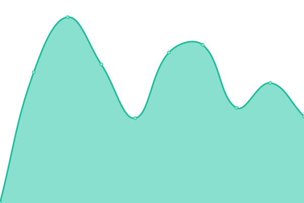

# [📈 Live Status](https://status.migraine.kr): <!--live status--> **🟧 Partial outage**

This repository contains the open-source uptime monitor and status page for [MigraineKR](https://status.migraine.kr), powered by [Upptime](https://github.com/upptime/upptime).

With [Upptime](https://upptime.js.org), you can get your own unlimited and free uptime monitor and status page, powered entirely by a GitHub repository. We use [Issues](https://github.com/MigraineKR/status/issues) as incident reports, [Actions](https://github.com/MigraineKR/status/actions) as uptime monitors, and [Pages](https://status.migraine.kr) for the status page.

<!--start: status pages-->
<!-- This summary is generated by Upptime (https://github.com/upptime/upptime) -->
<!-- Do not edit this manually, your changes will be overwritten -->
<!-- prettier-ignore -->
| URL | Status | History | Response Time | Uptime |
| --- | ------ | ------- | ------------- | ------ |
|  [ihs-headache.org](https://ihs-headache.org/) | 🟩 Up | [ihs-headache-org.yml](https://github.com/MigraineKR/upptime/commits/HEAD/history/ihs-headache-org.yml) | 

 1277ms
     
 | 

<a href="https://upptime.migraine.kr/history/ihs-headache-org">100.00%</a>
    

|  [headache.or.kr](https://www.headache.or.kr/index.php) | 🟩 Up | [headache-or-kr.yml](https://github.com/MigraineKR/upptime/commits/HEAD/history/headache-or-kr.yml) | 

 2407ms
     
 | 

<a href="https://upptime.migraine.kr/history/headache-or-kr">100.00%</a>
    

|  [migrainecluster.com](http://www.migrainecluster.com/) | 🟩 Up | [migrainecluster-com.yml](https://github.com/MigraineKR/upptime/commits/HEAD/history/migrainecluster-com.yml) | 

 866ms
     
 | 

<a href="https://upptime.migraine.kr/history/migrainecluster-com">100.00%</a>
    

|  [americanheadachesociety.org](https://americanheadachesociety.org/) | 🟩 Up | [americanheadachesociety-org.yml](https://github.com/MigraineKR/upptime/commits/HEAD/history/americanheadachesociety-org.yml) | 

 1188ms
     
 | 

<a href="https://upptime.migraine.kr/history/americanheadachesociety-org">100.00%</a>
    

|  [americanmigrainefoundation.org](https://americanmigrainefoundation.org/) | 🟩 Up | [americanmigrainefoundation-org.yml](https://github.com/MigraineKR/upptime/commits/HEAD/history/americanmigrainefoundation-org.yml) | 

 387ms
     
 | 

<a href="https://upptime.migraine.kr/history/americanmigrainefoundation-org">100.00%</a>
    

|  [headaches.org](https://headaches.org/) | 🟩 Up | [headaches-org.yml](https://github.com/MigraineKR/upptime/commits/HEAD/history/headaches-org.yml) | 

 403ms
     
 | 

<a href="https://upptime.migraine.kr/history/headaches-org">100.00%</a>
    

|  [clusterbusters.org](https://clusterbusters.org/) | 🟩 Up | [clusterbusters-org.yml](https://github.com/MigraineKR/upptime/commits/HEAD/history/clusterbusters-org.yml) | 

 424ms
     
 | 

<a href="https://upptime.migraine.kr/history/clusterbusters-org">100.00%</a>
    

|  [daniellefoundation.org](https://daniellefoundation.org/) | 🟩 Up | [daniellefoundation-org.yml](https://github.com/MigraineKR/upptime/commits/HEAD/history/daniellefoundation-org.yml) | 

 379ms
     
 | 

<a href="https://upptime.migraine.kr/history/daniellefoundation-org">100.00%</a>
    

|  [headachemigraine.org](https://headachemigraine.org/) | 🟩 Up | [headachemigraine-org.yml](https://github.com/MigraineKR/upptime/commits/HEAD/history/headachemigraine-org.yml) | 

 565ms
     
 | 

<a href="https://upptime.migraine.kr/history/headachemigraine-org">100.00%</a>
    

|  [jhsnet.net](https://www.jhsnet.net/) | 🟩 Up | [jhsnet-net.yml](https://github.com/MigraineKR/upptime/commits/HEAD/history/jhsnet-net.yml) | 

 877ms
     
 | 

<a href="https://upptime.migraine.kr/history/jhsnet-net">100.00%</a>
    

|  [jhsnet.net/english](https://www.jhsnet.net/english.html) | 🟩 Up | [jhsnet-net-english.yml](https://github.com/MigraineKR/upptime/commits/HEAD/history/jhsnet-net-english.yml) | 

 148ms
     
 | 

<a href="https://upptime.migraine.kr/history/jhsnet-net-english">100.00%</a>
    

|  [migraine.org.au](https://www.migraine.org.au/) | 🟩 Up | [migraine-org-au.yml](https://github.com/MigraineKR/upptime/commits/HEAD/history/migraine-org-au.yml) | 

 1553ms
     
 | 

<a href="https://upptime.migraine.kr/history/migraine-org-au">100.00%</a>
    

|  [headacheaustralia.org.au](https://headacheaustralia.org.au/) | 🟩 Up | [headacheaustralia-org-au.yml](https://github.com/MigraineKR/upptime/commits/HEAD/history/headacheaustralia-org-au.yml) | 

 1576ms
     
 | 

<a href="https://upptime.migraine.kr/history/headacheaustralia-org-au">100.00%</a>
    

|  [migrainecanada.org](https://migrainecanada.org/) | 🟩 Up | [migrainecanada-org.yml](https://github.com/MigraineKR/upptime/commits/HEAD/history/migrainecanada-org.yml) | 

 500ms
     
 | 

<a href="https://upptime.migraine.kr/history/migrainecanada-org">100.00%</a>
    

|  [migrainequebec.org](https://migrainequebec.org/) | 🟩 Up | [migrainequebec-org.yml](https://github.com/MigraineKR/upptime/commits/HEAD/history/migrainequebec-org.yml) | 

 362ms
     
 | 

<a href="https://upptime.migraine.kr/history/migrainequebec-org">100.00%</a>
    

|  [headache-help.org](https://www.headache-help.org/) | 🟥 Down | [headache-help-org.yml](https://github.com/MigraineKR/upptime/commits/HEAD/history/headache-help-org.yml) | 

 1293ms
     
 | 

<a href="https://upptime.migraine.kr/history/headache-help-org">98.87%</a>
    

|  [migreeni.org](https://migreeni.org/) | 🟩 Up | [migreeni-org.yml](https://github.com/MigraineKR/upptime/commits/HEAD/history/migreeni-org.yml) | 

 1660ms
     
 | 

<a href="https://upptime.migraine.kr/history/migreeni-org">100.00%</a>
    

|  [migraine.ie](http://migraine.ie/) | 🟩 Up | [migraine-ie.yml](https://github.com/MigraineKR/upptime/commits/HEAD/history/migraine-ie.yml) | 

 689ms
     
 | 

<a href="https://upptime.migraine.kr/history/migraine-ie">100.00%</a>
    

|  [hodepinenorge.no](https://hodepinenorge.no/) | 🟩 Up | [hodepinenorge-no.yml](https://github.com/MigraineKR/upptime/commits/HEAD/history/hodepinenorge-no.yml) | 

 1725ms
     
 | 

<a href="https://upptime.migraine.kr/history/hodepinenorge-no">99.69%</a>
    

|  [emhalliance.org](https://www.emhalliance.org/) | 🟩 Up | [emhalliance-org.yml](https://github.com/MigraineKR/upptime/commits/HEAD/history/emhalliance-org.yml) | 

 4981ms
     
 | 

<a href="https://upptime.migraine.kr/history/emhalliance-org">100.00%</a>
    

|  [chronicmigraineawareness.org](https://chronicmigraineawareness.org/) | 🟩 Up | [chronicmigraineawareness-org.yml](https://github.com/MigraineKR/upptime/commits/HEAD/history/chronicmigraineawareness-org.yml) | 

 196ms
     
 | 

<a href="https://upptime.migraine.kr/history/chronicmigraineawareness-org">100.00%</a>
    

|  [migraineworldsummit.com](https://migraineworldsummit.com/) | 🟩 Up | [migraineworldsummit-com.yml](https://github.com/MigraineKR/upptime/commits/HEAD/history/migraineworldsummit-com.yml) | 

 197ms
     
 | 

<a href="https://upptime.migraine.kr/history/migraineworldsummit-com">100.00%</a>
    

|  [migraineagain.com](https://www.migraineagain.com/) | 🟩 Up | [migraineagain-com.yml](https://github.com/MigraineKR/upptime/commits/HEAD/history/migraineagain-com.yml) | 

 383ms
     
 | 

<a href="https://upptime.migraine.kr/history/migraineagain-com">100.00%</a>
    

|  [migrainetrust.org](https://migrainetrust.org/) | 🟩 Up | [migrainetrust-org.yml](https://github.com/MigraineKR/upptime/commits/HEAD/history/migrainetrust-org.yml) | 

 728ms
     
 | 

<a href="https://upptime.migraine.kr/history/migrainetrust-org">99.52%</a>
    

|  [migrainedisorders.org](https://www.migrainedisorders.org/) | 🟩 Up | [migrainedisorders-org.yml](https://github.com/MigraineKR/upptime/commits/HEAD/history/migrainedisorders-org.yml) | 

 1613ms
     
 | 

<a href="https://upptime.migraine.kr/history/migrainedisorders-org">93.99%</a>
    

|  [migrainecollaborative.org](https://migrainecollaborative.org/) | 🟩 Up | [migrainecollaborative-org.yml](https://github.com/MigraineKR/upptime/commits/HEAD/history/migrainecollaborative-org.yml) | 

 493ms
     
 | 

<a href="https://upptime.migraine.kr/history/migrainecollaborative-org">100.00%</a>
    

|  [parentingwithmigraine.com](https://parentingwithmigraine.com/) | 🟩 Up | [parentingwithmigraine-com.yml](https://github.com/MigraineKR/upptime/commits/HEAD/history/parentingwithmigraine-com.yml) | 

 939ms
     
 | 

<a href="https://upptime.migraine.kr/history/parentingwithmigraine-com">100.00%</a>
    

|  [milesformigraine.org](https://www.milesformigraine.org/) | 🟩 Up | [milesformigraine-org.yml](https://github.com/MigraineKR/upptime/commits/HEAD/history/milesformigraine-org.yml) | 

 567ms
     
 | 

<a href="https://upptime.migraine.kr/history/milesformigraine-org">100.00%</a>
    

|  [shadesformigraine.org](https://shadesformigraine.org/) | 🟩 Up | [shadesformigraine-org.yml](https://github.com/MigraineKR/upptime/commits/HEAD/history/shadesformigraine-org.yml) | 

 490ms
     
 | 

<a href="https://upptime.migraine.kr/history/shadesformigraine-org">100.00%</a>
    

|  [mymigrainelife.net](https://www.mymigrainelife.net/) | 🟩 Up | [mymigrainelife-net.yml](https://github.com/MigraineKR/upptime/commits/HEAD/history/mymigrainelife-net.yml) | 

 495ms
     
 | 

<a href="https://upptime.migraine.kr/history/mymigrainelife-net">100.00%</a>
    

|  [headachemigraineforum.org](https://www.headachemigraineforum.org/) | 🟩 Up | [headachemigraineforum-org.yml](https://github.com/MigraineKR/upptime/commits/HEAD/history/headachemigraineforum-org.yml) | 

 316ms
     
 | 

<a href="https://upptime.migraine.kr/history/headachemigraineforum-org">100.00%</a>
    

|  [migraine.com](https://migraine.com/) | 🟩 Up | [migraine-com.yml](https://github.com/MigraineKR/upptime/commits/HEAD/history/migraine-com.yml) | 

 655ms
     
 | 

<a href="https://upptime.migraine.kr/history/migraine-com">100.00%</a>
    

|  [worldheadachesociety.org](https://worldheadachesociety.org/) | 🟥 Down | [worldheadachesociety-org.yml](https://github.com/MigraineKR/upptime/commits/HEAD/history/worldheadachesociety-org.yml) | 

 145ms
     
 | 

<a href="https://upptime.migraine.kr/history/worldheadachesociety-org">0.00%</a>
    

|  [patientadvocate.org](https://www.patientadvocate.org/) | 🟩 Up | [patientadvocate-org.yml](https://github.com/MigraineKR/upptime/commits/HEAD/history/patientadvocate-org.yml) | 

 770ms
     
 | 

<a href="https://upptime.migraine.kr/history/patientadvocate-org">99.01%</a>
    

<!--end: status pages-->

[**Visit our status website →**](https://status.migraine.kr)

## 📄 License

- Powered by: [Upptime](https://github.com/upptime/upptime)
- Code: [MIT](./LICENSE) © [MigraineKR](https://status.migraine.kr)
- Data in the `./history` directory: [Open Database License](https://opendatacommons.org/licenses/odbl/1-0/)
